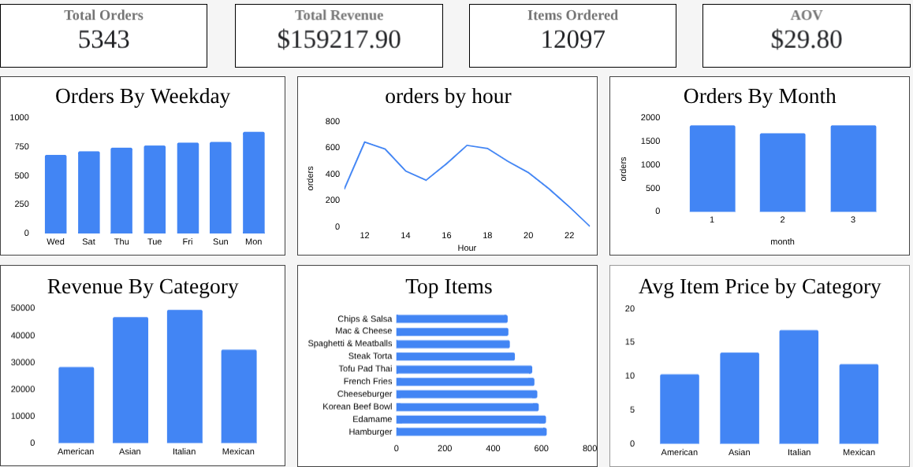

# restaurant-orders-analysis

# 🍽️ Restaurant Orders Analysis — Q1 2023
 
Exploratory data analysis of a quarter's worth of orders from a fictitious restaurant serving international cuisine, built entirely in Google Sheets.
 
---
 
## 📊 Dashboard

 
---
 
## 📈 Key Metrics
| Metric | Value |
|---|---|
| Total Orders | 5,343 |
| Total Revenue | $159,217.90 |
| Items Ordered | 12,097 |
| AOV | $29.80 |
 
---
 
## 🔍 Key Insights
 
- **Italian cuisine** generates the most revenue ($49,462) thanks to the highest avg item price ($16.78), while **American** leads in order volume but ranks last in revenue
- **Monday** is the busiest day (881 orders) and peak hours are **12pm** and **5pm** — strong lunch and dinner rushes
- **Hamburger** and **Edamame** are the top ordered items; **Chicken Tacos** is the least ordered with only 123 orders
- **Mexican** has the most room for menu development based on lower avg item price ($11.82) and underperforming items
---
 
## 🛠️ Tools & Skills
Google Sheets — pivot tables, QUERY formulas, charts, dashboard design
